# OpenSource Scout

> **Discover the best open-source repositories to contribute to based on your programming language, framework, skill level, and contribution goals.**

OpenSource Scout is a developer-focused platform that helps contributors find high-quality GitHub repositories with active communities, beginner-friendly issues, healthy maintenance activity, and meaningful contribution opportunities.

---

## Table of Contents

- [Vision](#vision)
- [Roadmap](#roadmap)
- [Implementation Plan](#implementation-plan)
- [Features](#features)
- [Technology Stack](#technology-stack)
- [System Architecture](#system-architecture)
- [Repository Analysis Pipeline](#repository-analysis-pipeline)
- [Recommendation Flow](#recommendation-flow)
- [Project Structure](#project-structure)
- [Installation](#installation)
- [Documentation](#documentation)
- [Security](#security)
- [Performance Optimizations](#performance-optimizations)
- [Challenges & Learnings](#challenges--learnings)
- [Future Enhancements](#future-enhancements)
- [Contributing](#contributing)

---

## Vision

The goal of OpenSource Scout is to **eliminate the frustration of finding the right open-source project**.

Instead of manually searching through thousands of repositories, developers can instantly discover repositories that match their **skills**, **interests**, and **learning objectives**.

---

## Roadmap

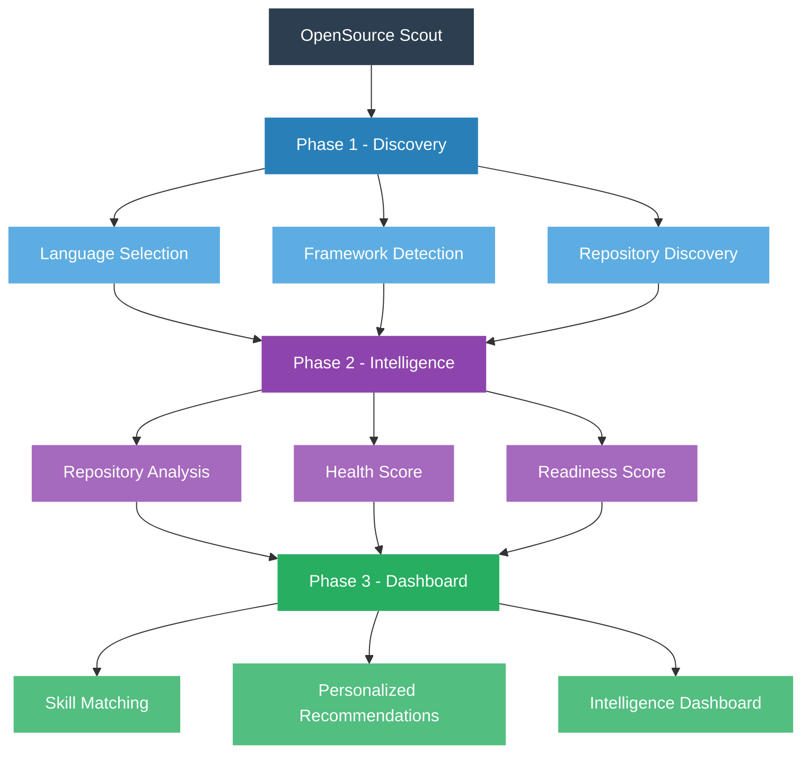
```mermaid
flowchart TD
    A[OpenSource Scout]
    A --> B[Phase 1 - Discovery]
    B --> B1[Language Selection]
    B --> B2[Framework Detection]
    B --> B3[Repository Discovery]
    B1 & B2 & B3 --> C[Phase 2 - Intelligence]
    C --> C1[Repository Analysis]
    C --> C2[Health Score]
    C --> C3[Readiness Score]
    C1 & C2 & C3 --> D[Phase 3 - Dashboard]
    D --> D1[Skill Matching]
    D --> D2[Personalized Recommendations]
    D --> D3[Intelligence Dashboard]

    style A fill:#2C3E50,color:#fff,stroke:none
    style B fill:#2980B9,color:#fff,stroke:none
    style B1 fill:#5DADE2,color:#fff,stroke:none
    style B2 fill:#5DADE2,color:#fff,stroke:none
    style B3 fill:#5DADE2,color:#fff,stroke:none
    style C fill:#8E44AD,color:#fff,stroke:none
    style C1 fill:#A569BD,color:#fff,stroke:none
    style C2 fill:#A569BD,color:#fff,stroke:none
    style C3 fill:#A569BD,color:#fff,stroke:none
    style D fill:#27AE60,color:#fff,stroke:none
    style D1 fill:#52BE80,color:#fff,stroke:none
    style D2 fill:#52BE80,color:#fff,stroke:none
    style D3 fill:#52BE80,color:#fff,stroke:none
```

---

## Implementation Plan

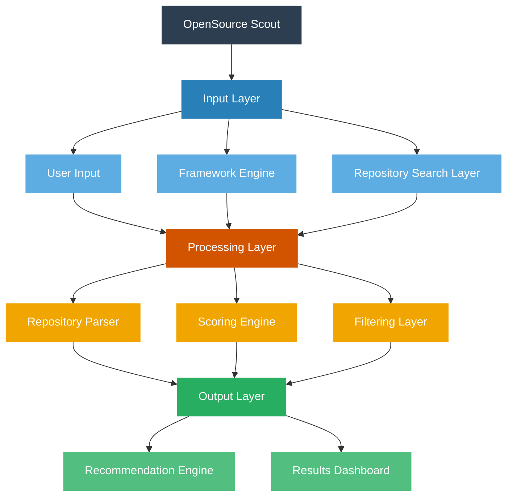
```mermaid
flowchart TD
    A[OpenSource Scout]
    A --> B[Input Layer]
    B --> B1[User Input]
    B --> B2[Framework Engine]
    B --> B3[Repository Search Layer]
    B1 & B2 & B3 --> C[Processing Layer]
    C --> C1[Repository Parser]
    C --> C2[Scoring Engine]
    C --> C3[Filtering Layer]
    C1 & C2 & C3 --> D[Output Layer]
    D --> D1[Recommendation Engine]
    D --> D2[Results Dashboard]

    style A fill:#2C3E50,color:#fff,stroke:none
    style B fill:#2980B9,color:#fff,stroke:none
    style B1 fill:#5DADE2,color:#fff,stroke:none
    style B2 fill:#5DADE2,color:#fff,stroke:none
    style B3 fill:#5DADE2,color:#fff,stroke:none
    style C fill:#D35400,color:#fff,stroke:none
    style C1 fill:#F0A500,color:#fff,stroke:none
    style C2 fill:#F0A500,color:#fff,stroke:none
    style C3 fill:#F0A500,color:#fff,stroke:none
    style D fill:#27AE60,color:#fff,stroke:none
    style D1 fill:#52BE80,color:#fff,stroke:none
    style D2 fill:#52BE80,color:#fff,stroke:none
```

---

## Features

### Repository Discovery

- Language-based repository search
- Framework-specific filtering
- Curated open-source opportunities
- Repository exploration dashboard

### Repository Analytics

| Metric | Description |
|--------|-------------|
| Stars Analysis | Track star growth and popularity trends |
| Fork Analysis | Measure community fork activity |
| Issue Analysis | Open vs closed issue ratio tracking |
| Activity Tracking | Commit frequency and recency |
| Contributor Statistics | Active contributors and team size |

### Contribution Intelligence

- Good First Issues Detection
- Difficulty Classification
- Repository Health Score
- Community Activity Metrics
- Contribution Readiness Analysis

### Developer Experience

- Modern responsive UI
- Fast repository discovery
- Interactive repository cards
- External GitHub repository navigation

---

## Technology Stack

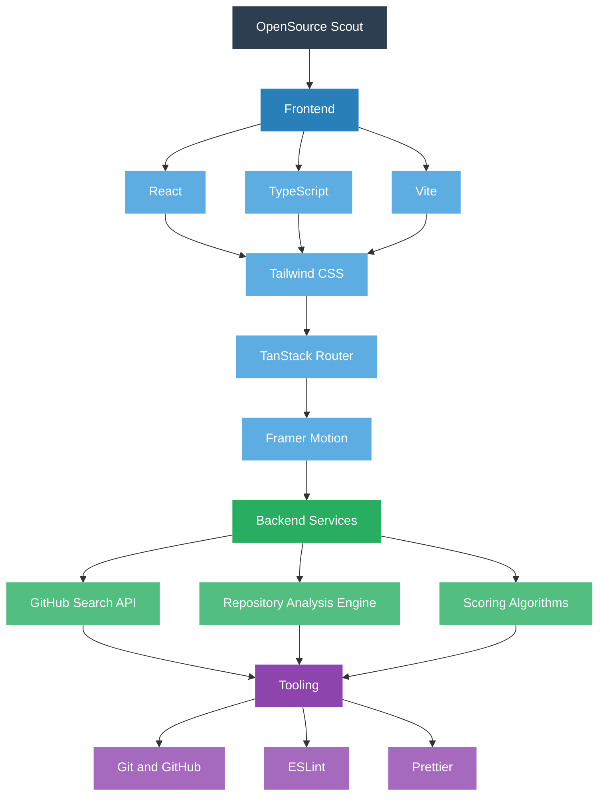
```mermaid
flowchart TD
    A[OpenSource Scout]
    A --> B[Frontend]
    B --> B1[React]
    B --> B2[TypeScript]
    B --> B3[Vite]
    B1 & B2 & B3 --> B4[Tailwind CSS]
    B4 --> B5[TanStack Router]
    B5 --> B6[Framer Motion]
    B6 --> C[Backend Services]
    C --> C1[GitHub Search API]
    C --> C2[Repository Analysis Engine]
    C --> C3[Scoring Algorithms]
    C1 & C2 & C3 --> D[Tooling]
    D --> D1[Git and GitHub]
    D --> D2[ESLint]
    D --> D3[Prettier]

    style A fill:#2C3E50,color:#fff,stroke:none
    style B fill:#2980B9,color:#fff,stroke:none
    style B1 fill:#5DADE2,color:#fff,stroke:none
    style B2 fill:#5DADE2,color:#fff,stroke:none
    style B3 fill:#5DADE2,color:#fff,stroke:none
    style B4 fill:#5DADE2,color:#fff,stroke:none
    style B5 fill:#5DADE2,color:#fff,stroke:none
    style B6 fill:#5DADE2,color:#fff,stroke:none
    style C fill:#27AE60,color:#fff,stroke:none
    style C1 fill:#52BE80,color:#fff,stroke:none
    style C2 fill:#52BE80,color:#fff,stroke:none
    style C3 fill:#52BE80,color:#fff,stroke:none
    style D fill:#8E44AD,color:#fff,stroke:none
    style D1 fill:#A569BD,color:#fff,stroke:none
    style D2 fill:#A569BD,color:#fff,stroke:none
    style D3 fill:#A569BD,color:#fff,stroke:none
```

---

## System Architecture

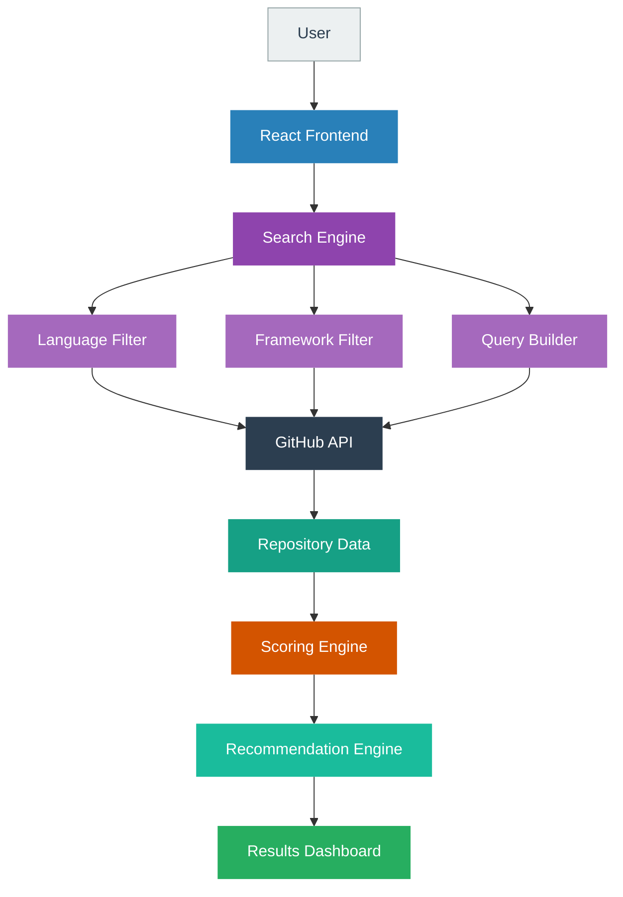
```mermaid
flowchart TD
    A[User]
    A --> B[React Frontend]
    B --> C[Search Engine]
    C --> C1[Language Filter]
    C --> C2[Framework Filter]
    C --> C3[Query Builder]
    C1 & C2 & C3 --> D[GitHub API]
    D --> E[Repository Data]
    E --> F[Scoring Engine]
    F --> G[Recommendation Engine]
    G --> H[Results Dashboard]

    style A fill:#ECF0F1,color:#2C3E50,stroke:#95A5A6
    style B fill:#2980B9,color:#fff,stroke:none
    style C fill:#8E44AD,color:#fff,stroke:none
    style C1 fill:#A569BD,color:#fff,stroke:none
    style C2 fill:#A569BD,color:#fff,stroke:none
    style C3 fill:#A569BD,color:#fff,stroke:none
    style D fill:#2C3E50,color:#fff,stroke:none
    style E fill:#16A085,color:#fff,stroke:none
    style F fill:#D35400,color:#fff,stroke:none
    style G fill:#1ABC9C,color:#fff,stroke:none
    style H fill:#27AE60,color:#fff,stroke:none
```

---

## Repository Analysis Pipeline

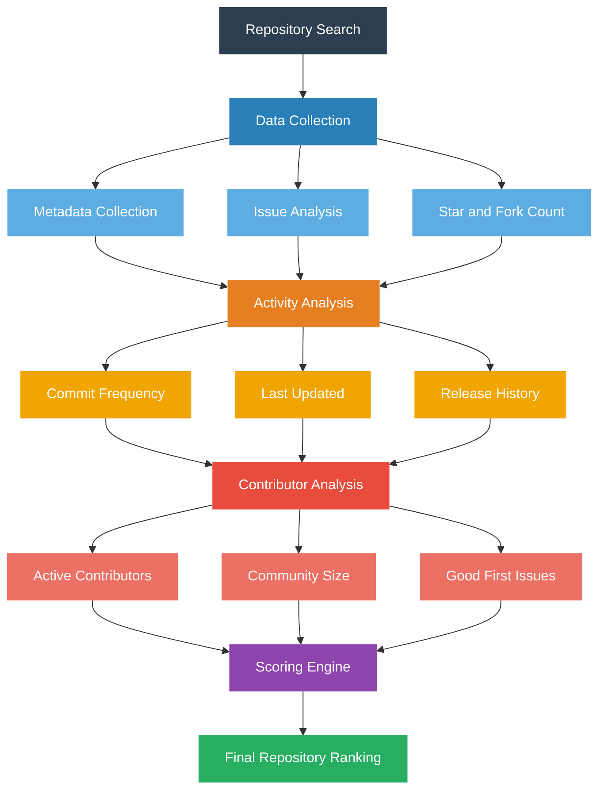
```mermaid
flowchart TD
    A[Repository Search]
    A --> B[Data Collection]
    B --> B1[Metadata Collection]
    B --> B2[Issue Analysis]
    B --> B3[Star and Fork Count]
    B1 & B2 & B3 --> C[Activity Analysis]
    C --> C1[Commit Frequency]
    C --> C2[Last Updated]
    C --> C3[Release History]
    C1 & C2 & C3 --> D[Contributor Analysis]
    D --> D1[Active Contributors]
    D --> D2[Community Size]
    D --> D3[Good First Issues]
    D1 & D2 & D3 --> E[Scoring Engine]
    E --> F[Final Repository Ranking]

    style A fill:#2C3E50,color:#fff,stroke:none
    style B fill:#2980B9,color:#fff,stroke:none
    style B1 fill:#5DADE2,color:#fff,stroke:none
    style B2 fill:#5DADE2,color:#fff,stroke:none
    style B3 fill:#5DADE2,color:#fff,stroke:none
    style C fill:#E67E22,color:#fff,stroke:none
    style C1 fill:#F0A500,color:#fff,stroke:none
    style C2 fill:#F0A500,color:#fff,stroke:none
    style C3 fill:#F0A500,color:#fff,stroke:none
    style D fill:#E74C3C,color:#fff,stroke:none
    style D1 fill:#EC7063,color:#fff,stroke:none
    style D2 fill:#EC7063,color:#fff,stroke:none
    style D3 fill:#EC7063,color:#fff,stroke:none
    style E fill:#8E44AD,color:#fff,stroke:none
    style F fill:#27AE60,color:#fff,stroke:none
```

---

## Recommendation Flow

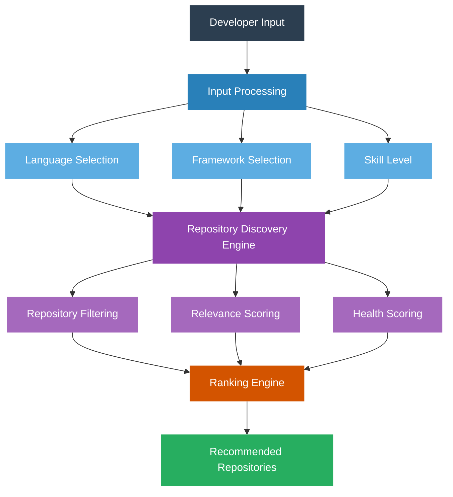
```mermaid
flowchart TD
    A[Developer Input]
    A --> B[Input Processing]
    B --> B1[Language Selection]
    B --> B2[Framework Selection]
    B --> B3[Skill Level]
    B1 & B2 & B3 --> C[Repository Discovery Engine]
    C --> C1[Repository Filtering]
    C --> C2[Relevance Scoring]
    C --> C3[Health Scoring]
    C1 & C2 & C3 --> D[Ranking Engine]
    D --> E[Recommended Repositories]

    style A fill:#2C3E50,color:#fff,stroke:none
    style B fill:#2980B9,color:#fff,stroke:none
    style B1 fill:#5DADE2,color:#fff,stroke:none
    style B2 fill:#5DADE2,color:#fff,stroke:none
    style B3 fill:#5DADE2,color:#fff,stroke:none
    style C fill:#8E44AD,color:#fff,stroke:none
    style C1 fill:#A569BD,color:#fff,stroke:none
    style C2 fill:#A569BD,color:#fff,stroke:none
    style C3 fill:#A569BD,color:#fff,stroke:none
    style D fill:#D35400,color:#fff,stroke:none
    style E fill:#27AE60,color:#fff,stroke:none
```

---

## Project Structure

```
OpenSourceScout/
├── public/
├── src/
│   ├── components/       # Reusable UI components
│   ├── hooks/            # Custom React hooks
│   ├── lib/              # Utility functions & helpers
│   ├── routes/           # TanStack Router route files
│   ├── router.tsx        # Router configuration
│   ├── main.tsx          # Application entry point
│   └── styles.css        # Global styles
├── package.json
├── vite.config.ts
├── tsconfig.json
└── README.md
```

---

## Installation

### 1. Clone Repository

```bash
git clone https://github.com/KrrishSR4/OpenSourceScout.git
cd OpenSourceScout
```

### 2. Install Dependencies

```bash
npm install
```

### 3. Setup Environment Variables

```bash
# Create a .env file in root directory
VITE_GITHUB_TOKEN=your_github_token_here
```

> Generate your GitHub token from [GitHub Settings - Developer Settings - Personal Access Tokens](https://github.com/settings/tokens)

### 4. Run Development Server

```bash
npm run dev
```

### 5. Production Build

```bash
npm run build
```

---

## Documentation

### Repository Discovery Flow

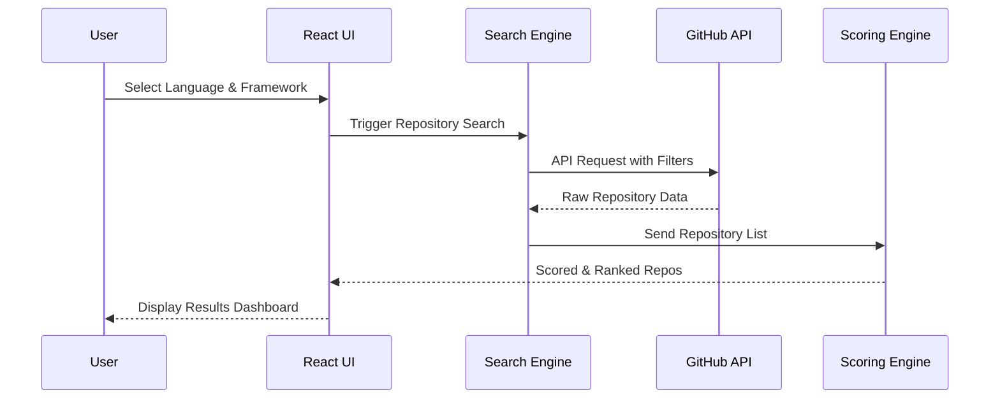
```mermaid
sequenceDiagram
    participant U as User
    participant UI as React UI
    participant SE as Search Engine
    participant GH as GitHub API
    participant SC as Scoring Engine

    U->>UI: Select Language & Framework
    UI->>SE: Trigger Repository Search
    SE->>GH: API Request with Filters
    GH-->>SE: Raw Repository Data
    SE->>SC: Send Repository List
    SC-->>UI: Scored & Ranked Repos
    UI-->>U: Display Results Dashboard
```

### Step-by-Step Usage

| Step | Action | Description |
|------|--------|-------------|
| 1 | Select Language | Choose your primary programming language |
| 2 | Select Framework | Pick a specific framework or library |
| 3 | Discover Repos | Browse curated repository results |
| 4 | Analyze Metrics | Review health scores and activity data |
| 5 | Contribute | Explore good first issues and start contributing |

---

## Security

OpenSource Scout follows these security best practices:

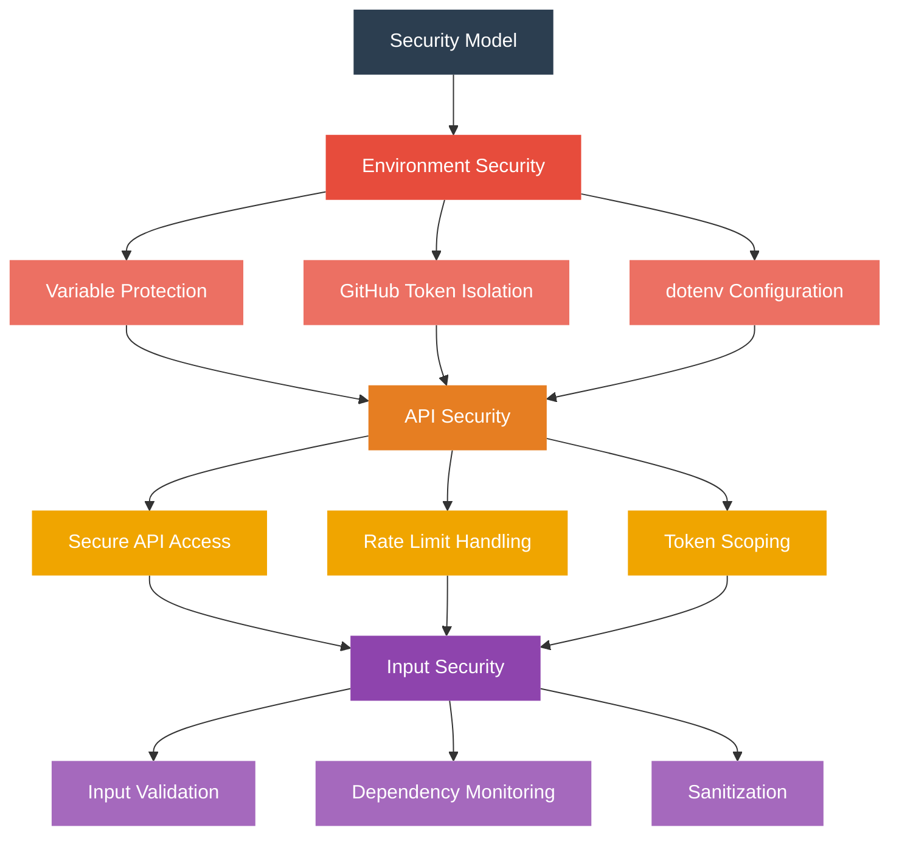
```mermaid
flowchart TD
    A[Security Model]
    A --> B[Environment Security]
    B --> B1[Variable Protection]
    B --> B2[GitHub Token Isolation]
    B --> B3[dotenv Configuration]
    B1 & B2 & B3 --> C[API Security]
    C --> C1[Secure API Access]
    C --> C2[Rate Limit Handling]
    C --> C3[Token Scoping]
    C1 & C2 & C3 --> D[Input Security]
    D --> D1[Input Validation]
    D --> D2[Dependency Monitoring]
    D --> D3[Sanitization]

    style A fill:#2C3E50,color:#fff,stroke:none
    style B fill:#E74C3C,color:#fff,stroke:none
    style B1 fill:#EC7063,color:#fff,stroke:none
    style B2 fill:#EC7063,color:#fff,stroke:none
    style B3 fill:#EC7063,color:#fff,stroke:none
    style C fill:#E67E22,color:#fff,stroke:none
    style C1 fill:#F0A500,color:#fff,stroke:none
    style C2 fill:#F0A500,color:#fff,stroke:none
    style C3 fill:#F0A500,color:#fff,stroke:none
    style D fill:#8E44AD,color:#fff,stroke:none
    style D1 fill:#A569BD,color:#fff,stroke:none
    style D2 fill:#A569BD,color:#fff,stroke:none
    style D3 fill:#A569BD,color:#fff,stroke:none
```

### Environment Setup

```bash
# CORRECT - Store token in .env (never commit this file)
VITE_GITHUB_TOKEN=your_token_here
```

```bash
# WRONG - Never hardcode tokens in source files
const token = "ghp_xxxxxxxxxxxx"
```

> Always add `.env` to your `.gitignore` file.

---

## Performance Optimizations

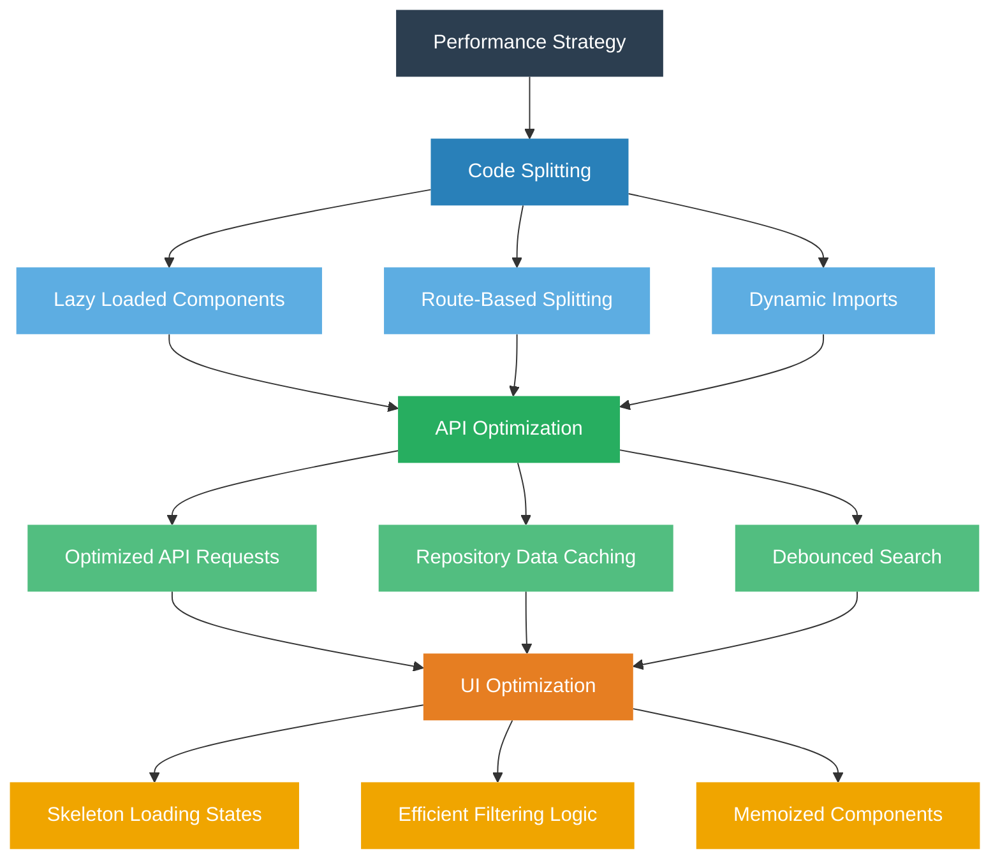
```mermaid
flowchart TD
    A[Performance Strategy]
    A --> B[Code Splitting]
    B --> B1[Lazy Loaded Components]
    B --> B2[Route-Based Splitting]
    B --> B3[Dynamic Imports]
    B1 & B2 & B3 --> C[API Optimization]
    C --> C1[Optimized API Requests]
    C --> C2[Repository Data Caching]
    C --> C3[Debounced Search]
    C1 & C2 & C3 --> D[UI Optimization]
    D --> D1[Skeleton Loading States]
    D --> D2[Efficient Filtering Logic]
    D --> D3[Memoized Components]

    style A fill:#2C3E50,color:#fff,stroke:none
    style B fill:#2980B9,color:#fff,stroke:none
    style B1 fill:#5DADE2,color:#fff,stroke:none
    style B2 fill:#5DADE2,color:#fff,stroke:none
    style B3 fill:#5DADE2,color:#fff,stroke:none
    style C fill:#27AE60,color:#fff,stroke:none
    style C1 fill:#52BE80,color:#fff,stroke:none
    style C2 fill:#52BE80,color:#fff,stroke:none
    style C3 fill:#52BE80,color:#fff,stroke:none
    style D fill:#E67E22,color:#fff,stroke:none
    style D1 fill:#F0A500,color:#fff,stroke:none
    style D2 fill:#F0A500,color:#fff,stroke:none
    style D3 fill:#F0A500,color:#fff,stroke:none
```

| Optimization | Benefit |
|-------------|---------|
| Lazy Loaded Components | Faster initial page load |
| Repository Data Caching | Reduced API calls |
| Debounced Search | Avoids excessive API requests |
| Skeleton Loading States | Better perceived performance |
| Route-Based Code Splitting | Smaller JS bundles per route |
| Efficient Filtering Logic | Smooth client-side filtering |

---

## Challenges & Learnings

### Challenges Faced

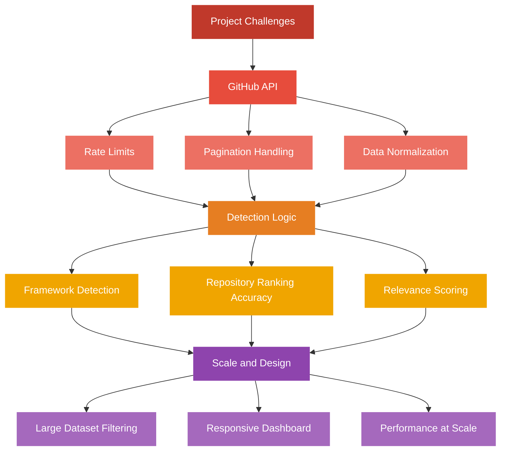
```mermaid
flowchart TD
    A[Project Challenges]
    A --> B[GitHub API]
    B --> B1[Rate Limits]
    B --> B2[Pagination Handling]
    B --> B3[Data Normalization]
    B1 & B2 & B3 --> C[Detection Logic]
    C --> C1[Framework Detection]
    C --> C2[Repository Ranking Accuracy]
    C --> C3[Relevance Scoring]
    C1 & C2 & C3 --> D[Scale and Design]
    D --> D1[Large Dataset Filtering]
    D --> D2[Responsive Dashboard]
    D --> D3[Performance at Scale]

    style A fill:#C0392B,color:#fff,stroke:none
    style B fill:#E74C3C,color:#fff,stroke:none
    style B1 fill:#EC7063,color:#fff,stroke:none
    style B2 fill:#EC7063,color:#fff,stroke:none
    style B3 fill:#EC7063,color:#fff,stroke:none
    style C fill:#E67E22,color:#fff,stroke:none
    style C1 fill:#F0A500,color:#fff,stroke:none
    style C2 fill:#F0A500,color:#fff,stroke:none
    style C3 fill:#F0A500,color:#fff,stroke:none
    style D fill:#8E44AD,color:#fff,stroke:none
    style D1 fill:#A569BD,color:#fff,stroke:none
    style D2 fill:#A569BD,color:#fff,stroke:none
    style D3 fill:#A569BD,color:#fff,stroke:none
```

### Key Learnings

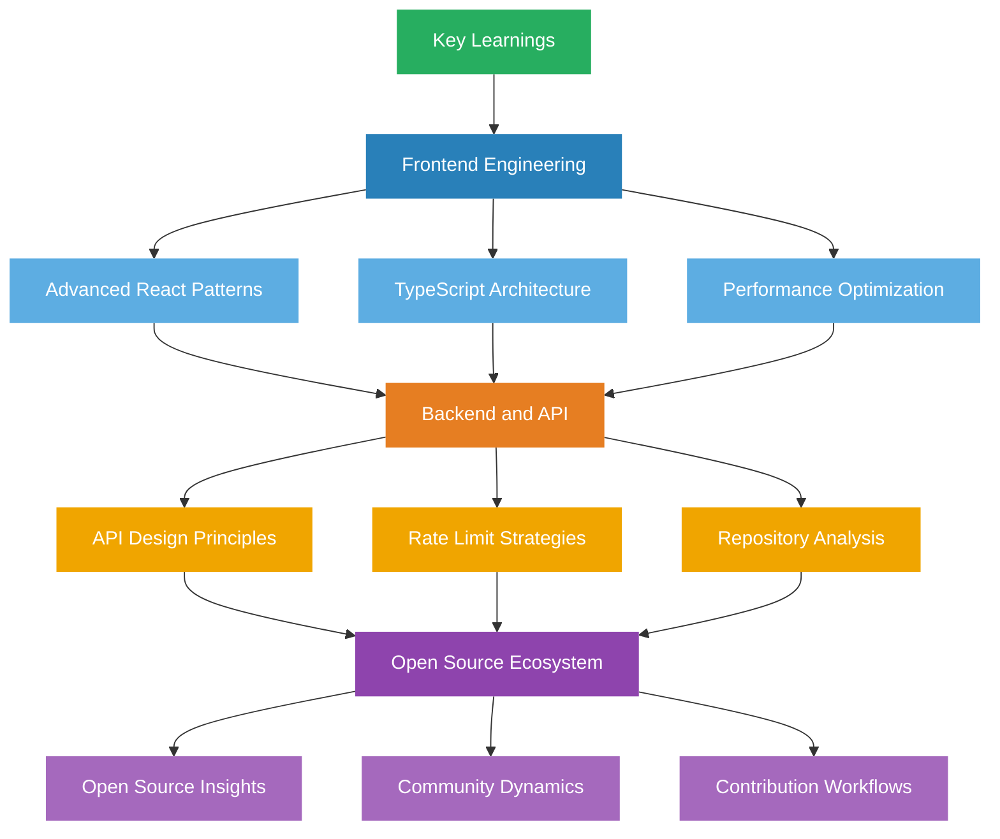
```mermaid
flowchart TD
    A[Key Learnings]
    A --> B[Frontend Engineering]
    B --> B1[Advanced React Patterns]
    B --> B2[TypeScript Architecture]
    B --> B3[Performance Optimization]
    B1 & B2 & B3 --> C[Backend and API]
    C --> C1[API Design Principles]
    C --> C2[Rate Limit Strategies]
    C --> C3[Repository Analysis]
    C1 & C2 & C3 --> D[Open Source Ecosystem]
    D --> D1[Open Source Insights]
    D --> D2[Community Dynamics]
    D --> D3[Contribution Workflows]

    style A fill:#27AE60,color:#fff,stroke:none
    style B fill:#2980B9,color:#fff,stroke:none
    style B1 fill:#5DADE2,color:#fff,stroke:none
    style B2 fill:#5DADE2,color:#fff,stroke:none
    style B3 fill:#5DADE2,color:#fff,stroke:none
    style C fill:#E67E22,color:#fff,stroke:none
    style C1 fill:#F0A500,color:#fff,stroke:none
    style C2 fill:#F0A500,color:#fff,stroke:none
    style C3 fill:#F0A500,color:#fff,stroke:none
    style D fill:#8E44AD,color:#fff,stroke:none
    style D1 fill:#A569BD,color:#fff,stroke:none
    style D2 fill:#A569BD,color:#fff,stroke:none
    style D3 fill:#A569BD,color:#fff,stroke:none
```

---

## Future Enhancements

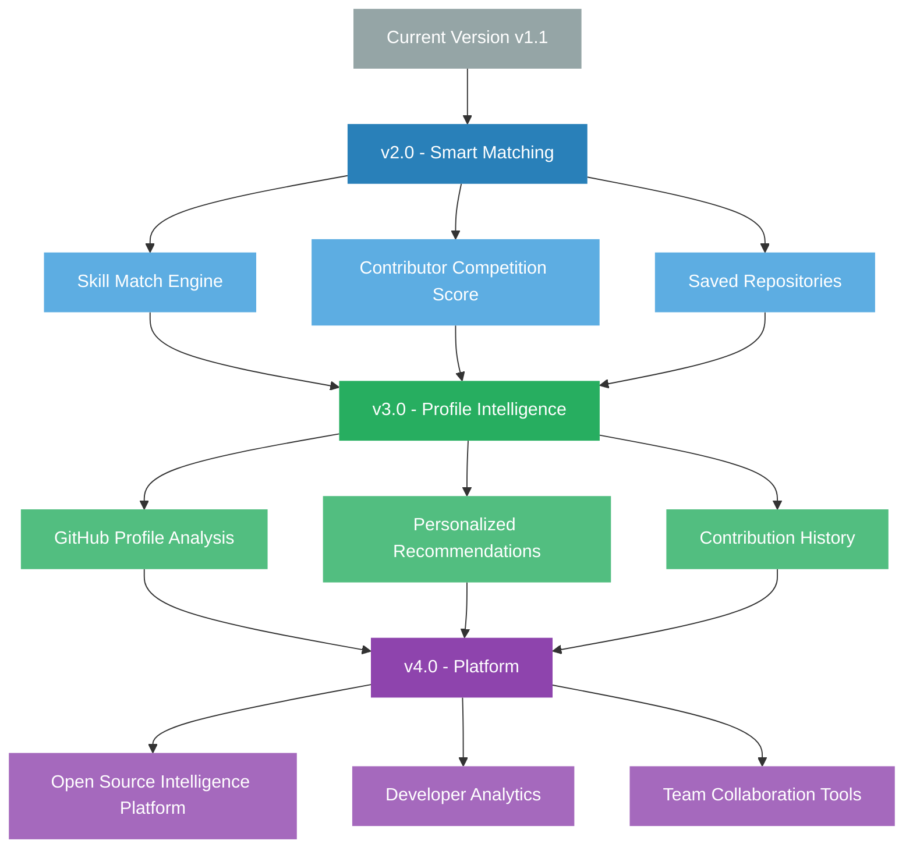
```mermaid
flowchart TD
    A[Current Version v1.1]
    A --> B[v2.0 - Smart Matching]
    B --> B1[Skill Match Engine]
    B --> B2[Contributor Competition Score]
    B --> B3[Saved Repositories]
    B1 & B2 & B3 --> C[v3.0 - Profile Intelligence]
    C --> C1[GitHub Profile Analysis]
    C --> C2[Personalized Recommendations]
    C --> C3[Contribution History]
    C1 & C2 & C3 --> D[v4.0 - Platform]
    D --> D1[Open Source Intelligence Platform]
    D --> D2[Developer Analytics]
    D --> D3[Team Collaboration Tools]

    style A fill:#95A5A6,color:#fff,stroke:none
    style B fill:#2980B9,color:#fff,stroke:none
    style B1 fill:#5DADE2,color:#fff,stroke:none
    style B2 fill:#5DADE2,color:#fff,stroke:none
    style B3 fill:#5DADE2,color:#fff,stroke:none
    style C fill:#27AE60,color:#fff,stroke:none
    style C1 fill:#52BE80,color:#fff,stroke:none
    style C2 fill:#52BE80,color:#fff,stroke:none
    style C3 fill:#52BE80,color:#fff,stroke:none
    style D fill:#8E44AD,color:#fff,stroke:none
    style D1 fill:#A569BD,color:#fff,stroke:none
    style D2 fill:#A569BD,color:#fff,stroke:none
    style D3 fill:#A569BD,color:#fff,stroke:none
```

| Phase | Feature | Status |
|-------|---------|--------|
| v1.0 | Language & Framework Discovery | Done |
| v1.1 | Repository Health Score | Done |
| v2.0 | Skill Match Engine | In Progress |
| v2.1 | Contributor Competition Score | Planned |
| v2.2 | Saved Repositories | Planned |
| v3.0 | GitHub Profile Analysis | Future |
| v3.1 | Personalized Recommendations | Future |
| v4.0 | Open Source Intelligence Platform | Future |

---

## Contributing

Contributions are welcome! Here's how you can help:

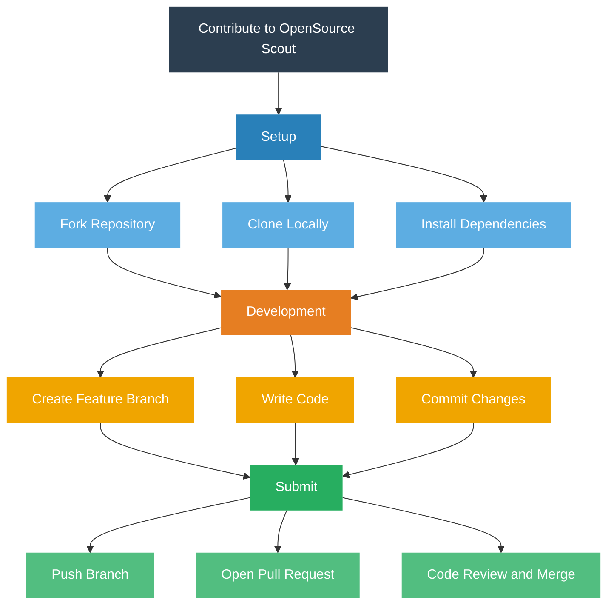
```mermaid
flowchart TD
    A[Contribute to OpenSource Scout]
    A --> B[Setup]
    B --> B1[Fork Repository]
    B --> B2[Clone Locally]
    B --> B3[Install Dependencies]
    B1 & B2 & B3 --> C[Development]
    C --> C1[Create Feature Branch]
    C --> C2[Write Code]
    C --> C3[Commit Changes]
    C1 & C2 & C3 --> D[Submit]
    D --> D1[Push Branch]
    D --> D2[Open Pull Request]
    D --> D3[Code Review and Merge]

    style A fill:#2C3E50,color:#fff,stroke:none
    style B fill:#2980B9,color:#fff,stroke:none
    style B1 fill:#5DADE2,color:#fff,stroke:none
    style B2 fill:#5DADE2,color:#fff,stroke:none
    style B3 fill:#5DADE2,color:#fff,stroke:none
    style C fill:#E67E22,color:#fff,stroke:none
    style C1 fill:#F0A500,color:#fff,stroke:none
    style C2 fill:#F0A500,color:#fff,stroke:none
    style C3 fill:#F0A500,color:#fff,stroke:none
    style D fill:#27AE60,color:#fff,stroke:none
    style D1 fill:#52BE80,color:#fff,stroke:none
    style D2 fill:#52BE80,color:#fff,stroke:none
    style D3 fill:#52BE80,color:#fff,stroke:none
```

### Steps

1. **Fork** the repository
2. **Create** a feature branch — `git checkout -b feature/your-feature-name`
3. **Commit** your changes — `git commit -m 'feat: add amazing feature'`
4. **Push** your branch — `git push origin feature/your-feature-name`
5. **Open** a Pull Request

> Together let's make open-source discovery easier for developers worldwide.

---

<div align="center">

Made with love by [KrrishSR4](https://github.com/KrrishSR4)

**Star this repo if you find it useful!**

</div>

